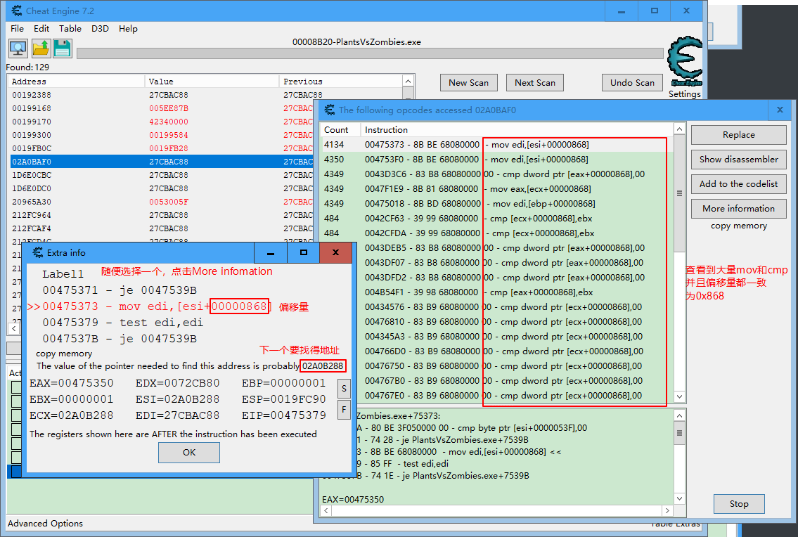

## CE

### 官网下载

https://www.cheatengine.org/downloads.php

### 查找精确值

先根据阳光值去First Scan，然后消耗游戏阳光值Next Scan，最后筛选出阳光值地址。


### 查找偏移量

#### 查找偏移量和上一个地址

点击Find out what accesses this address，找出什么访问了这个地址。


随便点击一个汇编指令，点击More information显示可能的地址为27CBAC88，记录偏移量0x5578。


#### 检索地址

把上一个地址复制出来27CBAC88，然后去检索，双击添加前十个后F5查看。


#### 查找正确的地址

找到**大量mov和cmp**命令的，并且**偏移量全部统一**的。复制地址02A0B288，记录偏移量0x868。



### 查到基址

持续查找地址，记录偏移量知道发现绿色地址，检索02A0B288地址时发现出现**绿色的地址**（即为基址），全部双击加入后F5查看，发现偏移量和地址为同一个值，所以这个007794F8即为基址。


#### Notepad记录全部偏移量

```bash
  地址      偏移量
27CBAC88    5578
02A0B288    0868
007794F8  #最后一个为基址
```

#### 检验是基址偏移

点击Add Address Manually -> 勾选Pointer -> Add Offset添加偏移，然后从下往上输入（记录也是，从最后记录的开始输）。然后更改这个值，发现更改后游戏数值即可变化。


