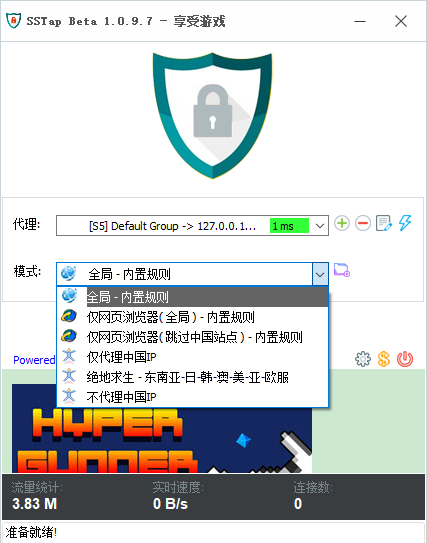
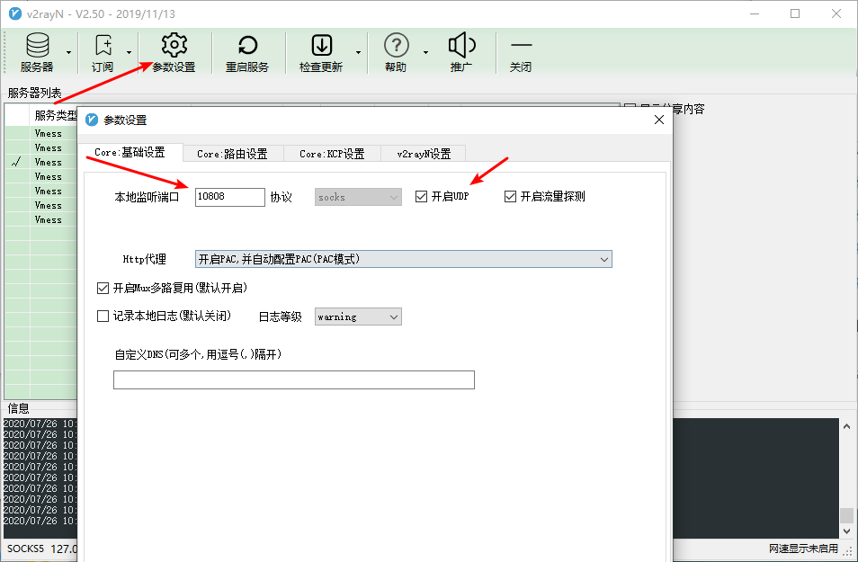
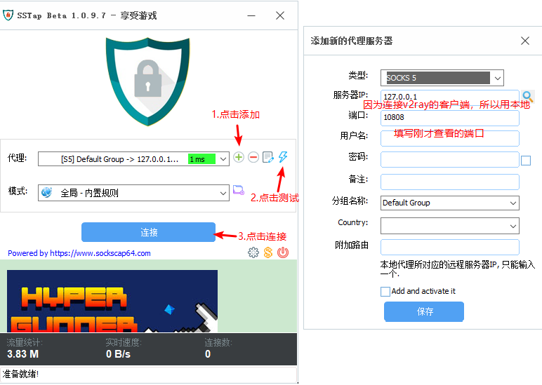
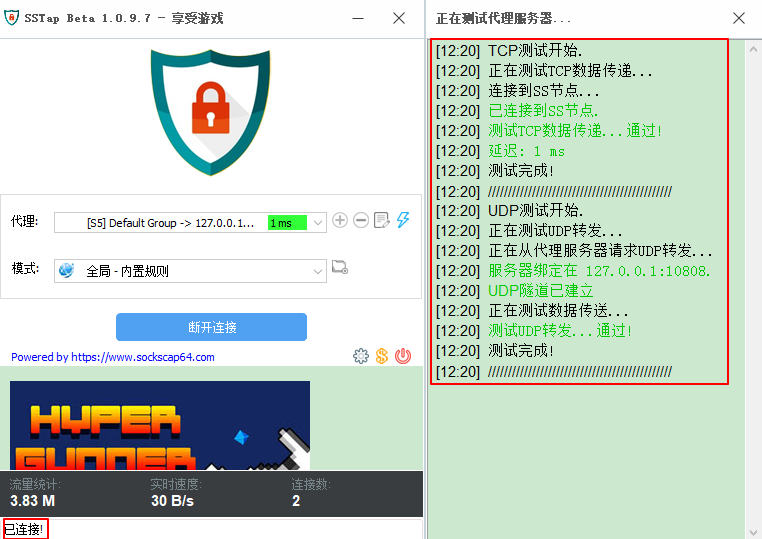

## NETCH

SSTap的进阶版，和SSTAP一样支持代理（多了v2ray、Trojan）、支持订阅、支持自定义代理（路由表/进程模式）、全局代理。TUN/TAP是虚拟网络设备。

常用代理

```bash
[TUN/TAP] 绕过局域网和中国大陆   #代表虚拟网卡代理非大陆IP
代理自定义程序   #模式->创建进程模式->扫描,选择安装程序的目录，会自动添加exe文件
```

NETCH=V2ray+SSTAP，netch直接使用VMess+[TUN/TAP] 绕过局域网和中国大陆可实现V2ray+SSTap同样的功能。


## SSTap

### SSTap简介
SSTap全称SOCKSTap, 是一款利用虚拟网卡技术在网络层实现的代理工具。SSTap能在网络层拦截所有连接并转发给HTTP、SOCKS4/5、Shadowsocks、ShadowsocksR代理。
而无需对被代理的应用程序做任何修改或设置。它能同时转发TCP、UDP数据包。

### SocksCap64简介
SocksCap64在功能上和proxifier差不多，都可以指定应用走Socks代理，无论那个应用程序是否支持。
SocksCap64和vpn的区别是，vpn一旦连接，就会所有应用程序掉线重练，而SocksCap64只有指定的应用程序需要重练。同时这个软件也支持UDP，对于玩游戏的非常合适！
SocksCap64是通过钩子来达到让指定软件/游戏走代理的，在某些软件/游戏中可能会不可用，甚至部分游戏会有封禁风险（当成外挂之类的）

### 区别
SSTap通过配置路由规则，根据目标服务器IP选择是否代理。SocksCap64直接选择本机的应用程序进行代理。

### SSTap全局代理

sstap不同于v2ray客户端和ssr客户端，sstap可以实现整个电脑的代理，不仅仅是网页的代理。

sstap和其他不一样的是，会在网络中新建一个SSTAP虚拟网卡，从而实现全软件代理（其他客户端仅仅用端口）。



全局：代理所有软件

仅网页浏览器（全局）：和v2ray全局一样，只代理浏览器

仅网页浏览器（跳过中国站点）：只代理浏览器，但是不代理中国站点

仅代理中国IP：代理所有软件，给海外华人用，只代理国内的IP，国外的一律不代理

不代理中国IP：代理所有软件，不代理中国的IP。

### SSTap+V2ray

1. 启动v2ray并调试通
2. 点击参数设置，查看本地端口并开启UDP



3.配置SSTap



4.测试并连接，测试TCP和UDP都通后。然后点击连接。



