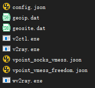

## v2ray

官网：http://www.v2ray.com/

## 安装

```shell
wget --no-check-certificate -O v2ray.sh https://git.io/v2ray.sh
chmod +x v2ray.sh 
./v2ray.sh 2>&1 | tee v2ray.log
```

脚本会自动安装以下文件：
/usr/bin/v2ray/v2ray：V2Ray 程序；

/usr/bin/v2ray/v2ctl：V2Ray 工具；

/etc/v2ray/config.json：配置文件；

/usr/bin/v2ray/geoip.dat：IP 数据文件

/usr/bin/v2ray/geosite.dat：域名数据文件

安装时使用kcp传输协议

v2ray url 可生成 vmess URL 链接 / 输入 v2ray qr 可生成二维码链接

记得开放防火墙端口,可以直接禁用防火墙: systemctl stop firewalld
## 多用户多端口配置

生成uuid

```shell
cat /proc/sys/kernel/random/uuid
```

添加一个用户包括端口及uuid，vi /etc/v2ray/config.json

```json
{
    "inbounds": [
        /*单个端口单个用户（使用kcp方式，不写streamSettings默认tcp），推荐*/
        {
            "port": 39290,
            "protocol": "vmess",
            "settings": {
                "clients": [
                    {
                        "id": "生成的uuid0",
                        "alterId": 16,
                        "email": "autumn@v2ray.com"
                    }
                ]
            },
            "streamSettings": {
                "network": "kcp",
                "kcpSettings": {
                    "header": {
                        "type": "none"
                    }
                }
            },
            "sniffing": {
                "enabled": true,
                "destOverride": [
                    "http",
                    "tls"
                ]
            }
        },
        /*一个端口多个用户，但是可能存在问题*/
        {
            "port": 39238,
            "protocol": "vmess",
            "settings": {
                "clients": [
                    {
                        "id": "生成的uuid1",
                        "level": 1,
                        "alterId": 16,
                        "email": "first@v2ray.com"
                    },
                    {
                        "id": "生成的uuid2",
                        "level": 1,
                        "alterId": 16,
                        "email": "second@v2ray.com"
                    }
                ]
            }
        }
    ]
}
```

## 使用

```shell
v2ray info //查看 V2Ray 配置信息
v2ray config //修改 V2Ray 配置
v2ray link //生成 V2Ray 配置文件链接
v2ray infolink //生成 V2Ray 配置信息链接
v2ray qr //生成 V2Ray 配置二维码链接
v2ray ss //修改 Shadowsocks 配置
v2ray ssinfo //查看 Shadowsocks 配置信息
v2ray ssqr //生成 Shadowsocks 配置二维码链接
v2ray status //查看 V2Ray 运行状态
v2ray start //启动 V2Ray
v2ray stop //停止 V2Ray
v2ray restart //重启 V2Ray
v2ray log //查看 V2Ray 运行日志
v2ray update //更新 V2Ray
v2ray update.sh //更新 V2Ray 管理脚本
v2ray uninstall //卸载 V2Ray

```
## 查看日志文件
日志文件配置存在于/etc/v2ray/config.json

access指定的log文件根据邮箱记录使用记录,可以查看ip,端口等信息，可以查看正在使用的邮箱。
```shell
tail -f /var/log/v2ray/access.log
```
error指定的log文件记录异常情况，当连接不上可以查看这里的日志。
```shell
tail -f /var/log/v2ray/error.log
```
## 常用命令
```shell
//查看v2ray版本
/usr/bin/v2ray/v2ray -version
//测试配置文件有效性，如果有问题则输出错误信息，不运行 V2Ray 主程序
/usr/bin/v2ray/v2ray -test -config /etc/v2ray/config.json
```
## journal 日志
```shell
journalctl -u v2ray
```
## BBR安装

bbr可以加速tcp协议,kcp是udp协议,没有意义

```shell
wget https://raw.githubusercontent.com/AutKevin/autumn/master/VPN/centOS%2BShadowsocks/bbr.sh
chmod +x bbr.sh
./bbr.sh
```
查看是否启用bbr

sysctl net.ipv4.tcp_available_congestion_control

## 客户端

### **V2ray官方内核** 

https://github.com/v2ray/v2ray-core/releases

[V2ray官方内核](https://github.com/v2fly/v2ray-core/releases)解压后如下，内核可以直接使用，但是没有GUI界面，以命令行方式启动。



### 基于内核的GUI软件

#### 电脑版

V2rayN

https://github.com/2dust/v2rayN/releases/tag/2.50，下载 [v2rayN-Core.zip](https://github.com/2dust/v2rayN/releases/download/4.20/v2rayN-Core.zip)（包含V2ray-Core内核），[v2rayN.zip](https://github.com/2dust/v2rayN/releases/download/4.20/v2rayN.zip)不包含内核（需要自己下载内核放进去）。

 Qv2ray

 https://github.com/Qv2ray/Qv2ray/releases，使用 Qt 编写的 v2ray 跨平台 GUI （MacOS, Windows, Linux），Qv2ray不包含v2ray-core内核，需要自己去官网下载内核放进去然后首选项配置。

#### 手机版

V2rayNG

https://github.com/2dust/v2rayNG/releases

## 局域网内共享
SOCKS5协议共享10808端口，HTTP协议共享10809端口。
SOCKS5协议需要修改客户端V2ray -> v2ray设置 -> 勾上允许来自局域网的连接。在另一台机器上telnet yourIP 10808，不通需要开放端口。
10809因为是http协议,可以直接在浏览器中设置代理，不需要第三方代理软件。
